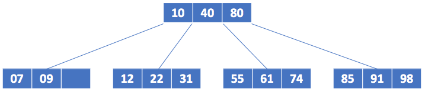
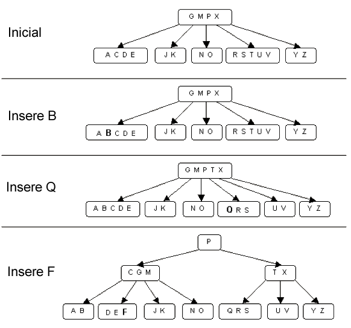

# Árvores B

 
 
 
 

 

 

Muitos dos problemas computacionais emergentes estão sendo caracterizados e/ou relacionados com conjuntos expressívos de dados. Nesse contexto, pensar em soluções que adotem estruturas <i>in memory</i> nem sempre é possível ou viável, o que leva à segmentação de tais conjuntos para manipulação e processamento em lotes.  

Uma das estruturas abordadas em literatura que lida adequadamente com o problema acima citado, estruturando grandes conjuntos de dados em sub-conjuntos menores de forma ordenada é a árvore B. A árvore B é considerada uma estrutura de dados auto-balanceada, na qual a criação e manutenção de nós garante que as folhas dessa estrutura (i.e., elementos de mais baixo nível) se mantenham todas sob mesmo nível hierárquico. Para garantir essa condição, o modelo de construção e manutenção adotado se baseia no conceito <i>bottom up</i> que define a composição de tal estrutura sempre da folha para a raiz. A Fig 1 representa uma visão geral dessa estrutura de dados. 

   
  <caption>Fig 1. Visão geral da estrutura de dados do tipo árvore B.</caption>

Considerando o modelo da Fig 1, pode-se definir uma série de propriedades importântes que fazem parte do modelo estrutural, como:

> **Propriedade 1:** A altura de uma árvore B é reduzida se comparada com as árvores até agora apresentadas. Isso, a um custo de se prolongar a estrutura de forma horizontal.
>
> **Propriedade 2:** Todo nó em uma árvore B com $N$ registros possui no mínimo $N + 1$ ponteiros para seus filhos, exceto os nós considerados folhas.
>
> **Propriedade 3:** A estrutura das folhas se diferem dos nós internos, apresentando uma variável que notificação para folha. Além disso, para algumas estruturas como B+ e B\*, os nós do tipo folha são os únicos a apresentarem dados, os demais nós são utilizados apenas para indexação. 
>
> **Propriedade 4:** Todo nó é definido com a seguinte estrutura: i) um valor para indicar o número de elementos no nó; ii) as chaves devem obrigatoriamente estarem dispostas de forma ordenada e; iii) um valor especial deve ser utilizado para indicar se o nó é folha ou não. 
>
> **Propriedade 5:** Existe um número máximo e mínimo de chaves que um nó pode ter. Dado M um fator de controle dos limites de cada nó, tem-se que o mínimo aceitável está em $m - 1$ elementos e o máximo em $2m - 1$, para valores de $m \geq 2$.
>
> **Propriedade 6:** Uma vez que um fator de composição $M$ é utilizado para definir o tamanho de cada nó, tem-se como altura $h$ da árvore $h = log_m \frac{n+1}{2}$.

# Exemplo 

Para detalhar os conceitos acima apresentados, considere uma estrutura de árvore B capaz de armazenar caracteres do tipo $char$. Nessa, o usuário introduz novos caracteres via terminal e a estrutura vai se formando a medida que essas novas inserções são realizadas. Nessa, o fator de decomposição M é 3 e os elementos a serem inseridos após um tempo de elaboração são: B, Q e F. A Fig 2 detalha as inserções e as decomposições necessárias para garantir a integridade e propriedades da árvore B em questão. 

   
  <caption>Fig 2. Procedimento de inserção e decomposição da árvore B segundo <a href="https://g.co/kgs/XGbHkp">Cormen at all 2012</a> capítulo 18.</caption>

Note pelo exemplo da Fig 2, que a inserção do item $B$ não afeta a estrutura, uma vez que sua capacidade máxima é atendida corretamente. Nesse caso, o item é inserido em ordem, mantendo então a integridade da estrutura em questão. Além disso, é importante observar que toda nova inserção é sempre realiada em uma folha, mesmo que nós intermediarios apresentem espaço para armazenamento. Fato que condiz com o modelo <i>bottom up</i> anteriormente discutido. 

Ao contrário da inserção de B, quando Q é introduzido esse produz uma divisão de página, visto que essa está em seu limite máximo e uma nova inserção não é aceitável. Nesse caso, antes da inserção do novo elemento, a página em questão é dividida e seu elemento mediano é levado para um nível acima. Como o nível observado para a inserção do item mediano, neste caso o caracter $T$, ainda não atingiu seu limite de $2m-1$, esse comporta $T$, o introduzindo de forma ordenada na coleção. Feito isso, um processo de atualização de filhos é realizada para comportar a nova decomposição que foi realizada. 

Por fim, quando F é inserido esse não só obriga a decomposição da folha responsável por sua alocação como também introduz a necessidade de docomposição para níveis acima. Dessa forma, é possível observar que novos elementos só são introduzidos em níveis intermediários e na raiz caso os níveis abaixo sobram decomposição. Caso contrário, a estrutura é apenas reordenada até se deparar com algum nó que ainda respeita os limites de informação estabelecidos. 

Para remoções, o princípio é o mesmo. Caso uma página se mostre com itens abaixo do mínimo aceitável essa inicia um processo de três estágios. Primeiro, é investigado se seu vizinho da direita pode lhe emprestar um item sem se depreciar em qualquer das propriedades. Em caso afirmativo, esse item é deslocado para manter os nós integros e nada mais é realizado. Caso contrário, essa investigação é realizada com seu vizinho esquerdo, para mesma tentativa de redefinição da ordem. Contudo, se nenhum de seus vizinhos pode lhe emprestar um item, a estrutura é refatorada em um nível acima, descendo um item e reduzindo o tamanho da página tida como pai do nó que produziu o problema em menos um item. 

# Compilação e Execução

A estrutura de árvore B disponibilizada possui um arquivo Makefile que realiza todo o procedimento de compilação e execução. Para tanto, temos as seguintes diretrizes de execução:

| Comando                |  Função                                                                                           |                     
| -----------------------| ------------------------------------------------------------------------------------------------- |
|  `make clean`          | Apaga a última compilação realizada contida na pasta build                                        |
|  `make`                | Executa a compilação do programa utilizando o gcc, e o resultado vai para a pasta build           |
|  `make run`            | Executa o programa da pasta build após a realização da compilação                                 |

# Contatos

 

<a style="color:black" href="mailto:michel@cefetmg.br?subject=[GitHub]%20Source%20Dynamic%20Lists">
✉️ <i>michel@cefetmg.br</i>
</a>

